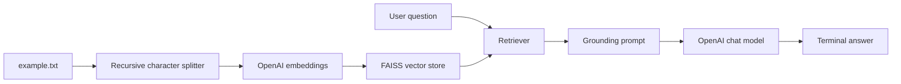

# RAG Q&A System

**Status: Experimental learning project**

A small command-line Retrieval-Augmented Generation example built with LangChain, OpenAI embeddings, FAISS, and a text document. It loads `example.txt`, splits it into overlapping chunks, retrieves relevant chunks, and asks an OpenAI chat model to answer from that context.

## Live Demo

[Open the deployed Streamlit app](https://rag-app-system-shxft5zzpqhv5jpxvmdhe3.streamlit.app/)

The public app was verified loading the RAG UI and building its in-memory index from `example.txt`. OpenAI functionality requires the configured Streamlit Cloud secret.

## Architecture



## Actual Workflow

1. Load `example.txt` with `TextLoader`.
2. Split the document into chunks with overlap.
3. Create `text-embedding-3-small` embeddings.
4. Build an in-memory FAISS index.
5. Retrieve relevant chunks for each question.
6. Send the context and question to `gpt-4o-mini`.
7. Print the answer until the user enters `quit`.

`build_index.py` is a separate indexing experiment for `data/docs.txt` and saves a local FAISS index. The current source uses the LangChain/OpenAI integration directly; there is no API server, authentication, evaluation suite, citation output, or automated test suite.

## Requirements

The source imports LangChain OpenAI, LangChain community loaders/vector stores, text splitters, `python-dotenv`, and FAISS. Install the dependencies listed in `requirements.txt`.

```bash
python -m venv .venv
# Windows: .venv\Scripts\activate
# macOS/Linux: source .venv/bin/activate
pip install -r requirements.txt
```

For Streamlit, create `.streamlit/secrets.toml` locally:

```toml
OPENAI_API_KEY = "your-api-key"
```

The file is ignored by Git. Copy `.streamlit/secrets.toml.example` as a starting point, or set `OPENAI_API_KEY` in the environment for command-line scripts. If neither is configured, the Streamlit app provides a password field for the current session and does not write the key to disk. On Streamlit Community Cloud, add the same key under the app's **Settings → Secrets**.
Never commit credentials.

## Run

For the interactive example:

```bash
python app.py
```

For the separate index-building experiment:

```bash
python build_index.py
```

The index-building script expects `data/docs.txt`; the interactive script expects `example.txt`.

The Streamlit app checks for a saved `faiss_index` next to `streamlit_app.py`. If it is absent, the app automatically builds an in-memory index from `example.txt`, so the demo can start without a separate indexing command. The first question still requires an OpenAI API key for embeddings and chat responses.

## Security Status

The repository now reads `OPENAI_API_KEY` from environment configuration and includes `.env.example`; `.env` remains ignored. If an earlier committed key was ever valid, rotate it separately because removing it from the current tree does not erase Git history.

## Limitations

- The index is rebuilt in memory by `app.py`.
- Retrieval is over the supplied text files only.
- Responses are not returned with citations or source spans.
- There is no document ingestion API, access control, prompt-injection defense, evaluation harness, or production deployment.
- The quality of answers depends on the configured OpenAI models and the small example corpus.

## Future Enhancements

Add source citations, safer document ingestion, input and output validation, a reviewed evaluation set, persistent vector storage, model configuration, retry/error handling, and a Streamlit or FastAPI interface.

## Resume Relevance

Demonstrates Python, LangChain, embeddings, FAISS vector search, prompt-based grounding, OpenAI API integration, and the core data flow of a small RAG system.

## Author

**Sunil Javadi**

- [GitHub](https://github.com/suniljavadi)
- [Portfolio](https://github.com/suniljavadi/sunil-portfolio)
- [LinkedIn](https://www.linkedin.com/in/sunil-javadi/)
